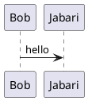
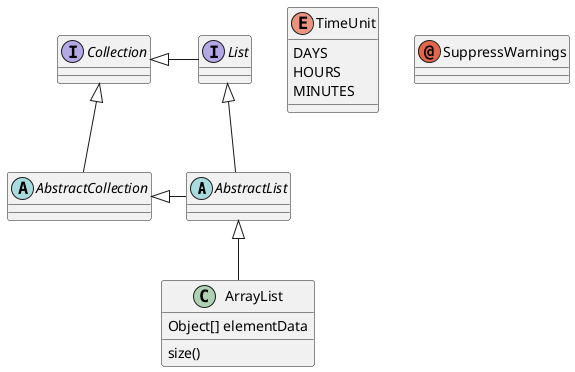

---
```plantuml
A->B:test
```


 A: DoWork;
activate A;
A -> B: Create Request;
activate B;
B -> C: DoWork;
activate C;
C --> B: WorkDone;
destroy C;
B --> A: Request Created;
deactivate B;
A --> User: Done;
deactivate A;
@enduml">





 parse -> execute;
   main -> init;
   main -> cleanup;
   execute -> make_string;
   execute -> printf
   init -> make_string;
   main -> printf;
   execute -> compare;
 }
'/>


    
